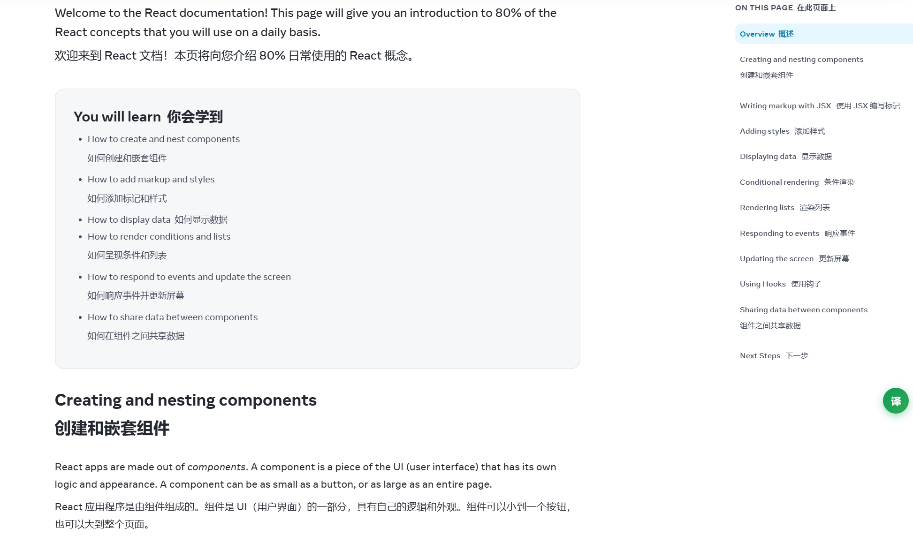
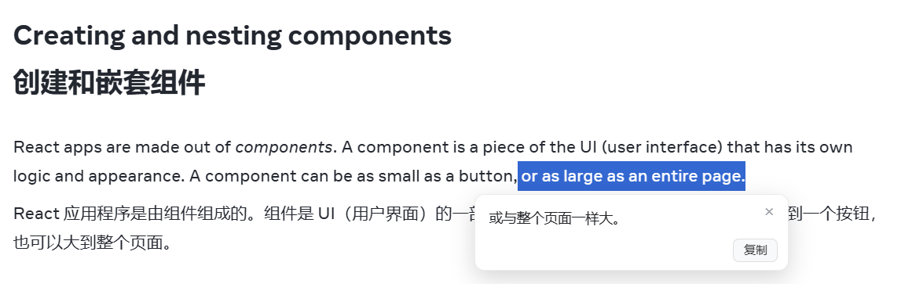
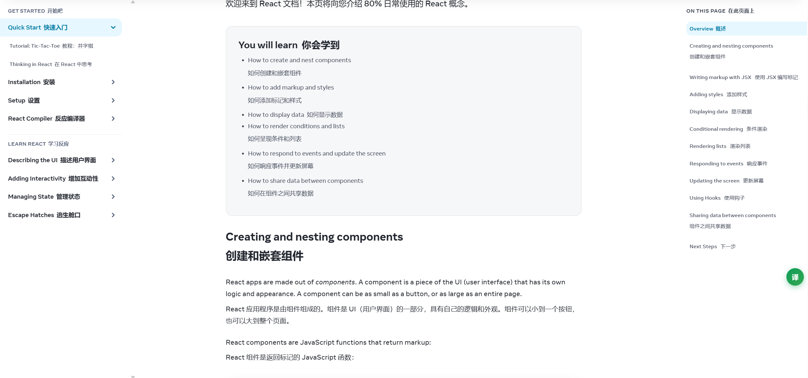
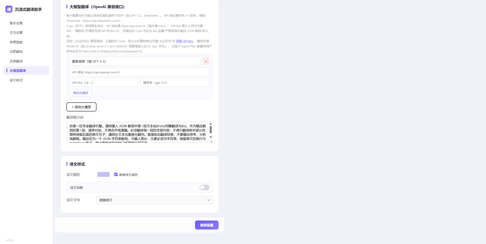

# ImmersiveLite · 沉浸式网页翻译


一款浏览器扩展（Chrome MV3），为网页提供**双语对照**的沉浸式翻译体验。复刻原版沉浸式翻译的 DOM 处理管线（段落识别 / 译文定位 / 站点规则），支持多种免费翻译服务与大模型翻译。

> 仓库：https://github.com/isXiaoMa/ImmersiveLite

## ✨ 功能特性

### 翻译能力

- **双语对照 / 仅译文**两种显示模式，可随时**即时切换**（无需重新翻译），译文默认继承原文颜色与样式
- **多翻译服务**：
  - 免费智能（微软 + 谷歌自动降级，推荐，开箱即用）
  - 谷歌翻译（免费，无需配置）
  - 百度翻译（需配置 appid + 密钥）
  - 大模型翻译（OpenAI 兼容协议）：GPT、DeepSeek、智谱 GLM、豆包（火山方舟）、Kimi、Coze、Ollama 本地等，支持自定义新增任意兼容服务
- **大模型卡片级独立测试**：每个模型卡片带「测试此模型」按钮，单独验证接入是否成功
- **可自定义翻译提示词**（所有大模型共用，支持 `{from}` / `{to}` 占位符）
- 深度思考模型（豆包 Seed、智谱 GLM、DeepSeek 等）自动禁用思维链，加速网页翻译
- **部分翻译检测**：译文残留大段原文时自动重试并降级兜底，防止大模型"偷懒只翻一半"
- 分批翻译 + 60s 超时控制 + 失败二分重试，长页面稳定翻译

### 翻译体验（复刻原版管线）

- **站点规则引擎**：内置从原版提取的 600+ 站点适配规则，优先级高于通用引擎，主流站点排版与原版一致
- **渐进式渲染**：逐段翻译逐段显示，每段带 loading 转圈
- **视口懒翻译**：滚动到可视区域才翻译，长页面性能友好
- **动态内容监听**：SPA 页面新增内容自动增量翻译
- **iframe / Shadow DOM**：内嵌框架与组件库文档站点内容全覆盖
- **网页标题翻译**：`译文 --- 原标题`，SPA 路由变化自动跟随
- 精细的译文插入规则：行内代码变量占位、`<br>` 多行段落、浮动图文环绕、目录 / 导航 / 卡片 / 按钮等场景下译文位置与原版一致

### 交互方式

- 弹窗控制：语言选择（支持交换）、服务切换、显示模式
- **页面悬浮球**：自由拖动，**自动记忆拖动位置**（全站点同步），点击翻译 / 还原
- **划词翻译**：选中文字自动弹出译文卡片，支持一键复制
- **侧边栏翻译面板**：弹窗一键打开，支持粘贴长文分块翻译（`Ctrl` + `Enter` 快捷执行）
- **右键菜单**：「翻译网页 / 显示原文」（标题随页面状态动态变化）、「翻译选中文本」
- **快捷键**：`Alt` + `Q` 切换翻译

### 译文样式

- 颜色跟随原文或自定义，可加粗，字号跟随原文或独立设置

## 📸 截图

| 双语对照                                       | 划词翻译                                        |
| ---------------------------------------------- | ----------------------------------------------- |
|  |  |

| 悬浮球                                        | 设置页                                      |
| --------------------------------------------- | ------------------------------------------- |
|  |  |

> 截图待补充，路径预留在 `docs/screenshots/`。

## 📥 安装（Chrome / Edge 等 Chromium 系浏览器）

1. `git clone` 或下载本项目 zip 并解压
2. 打开 `chrome://extensions`（Edge 为 `edge://extensions`）
3. 打开右上角**开发者模式**
4. 点击**加载已解压的扩展程序**，选择项目根目录
5. 工具栏出现"译"图标即可使用

## 🚀 快速上手

1. 点击工具栏图标打开弹窗，选择目标语言（默认简体中文）
2. 默认使用**免费智能**服务，开箱即用
3. 想用大模型翻译：设置页（弹窗右上角 ⚙）→「翻译服务」卡片点击**添加模型** → 填写服务名称、API 地址、API Key、模型名 → 点击**测试此模型**验证 → 在顶部「默认翻译服务」下拉选中它 → 保存

## 📁 项目结构

```
ImmersiveLite/
├── manifest.json            # Chrome MV3 清单
├── manifest-firefox.json    # Firefox 备用清单（当前未启用）
├── background/
│   └── service-worker.js    # 后台：消息路由、翻译 API 代理、右键菜单、快捷键
├── content/
│   ├── content.js           # 内容脚本：DOM 管线、译文插入、悬浮球、划词翻译
│   └── content.css          # 译文与页面内 UI 样式
├── popup/                   # 工栏弹窗
├── options/                 # 设置页
├── sidepanel/               # 侧边栏翻译面板
├── utils/
│   ├── languages.js         # 语言与服务列表
│   ├── site-rules.js        # 站点规则（提取自原版 1.32.5）
│   ├── md5.js               # 百度翻译签名依赖
│   ├── dropdown.js / .css   # 自定义下拉组件（popup/options 共用）
│   └── compat.js            # 跨浏览器 Promise 垫片（Chrome 下无操作）
├── tools/                   # DOM 对比等开发辅助工具
└── icons/                   # 图标
```

## 🌐 浏览器兼容性

| 浏览器                                  | 状态                                                                                                        |
| --------------------------------------- | ----------------------------------------------------------------------------------------------------------- |
| Chrome / Edge / 360 / QQ 等 Chromium 系 | ✅ 直接安装使用                                                                                             |
| Firefox                                 | 备用清单已就绪：将 `manifest-firefox.json` 重命名为 `manifest.json` 后打包，通过 `about:debugging` 临时加载 |
| Safari                                  | ❌ 暂不支持                                                                                                 |

## ❓ 常见问题

**Q：大模型测试报 HTTP 404 / ModelNotOpen？**
API Key 有效但该模型未在你的账户开通。到对应厂商控制台（如火山方舟「开通管理」）开通模型服务，或换用已开通的模型名。

**Q：整页翻译慢或一直转圈？**
深度思考模型（如 doubao-seed 系列 pro 档）速度较慢，建议在设置中换用 turbo / lite 档模型；插件已内置思维链禁用与超时重试。

**Q：某个站点译文排版不对？**
站点适配依赖规则库，可在 `utils/site-rules.js` 中参照现有条目为该站点补充规则（选择器白名单 / 追加块 / 排除区域）。

**Q：右键菜单标题不更新？**
标题在切换标签页、页面加载、翻译状态变化、修改设置时刷新，若个别页面未注入内容脚本则显示默认标题，属正常现象。

## ⚠️ 声明

本项目为个人学习与技术研究用途，通过对原版「沉浸式翻译」插件的公开发行包进行行为分析与逻辑复刻实现，不包含任何原版代码资产。仅供学习交流，请勿用于商业用途；使用本项目产生的任何后果由使用者自行承担。
